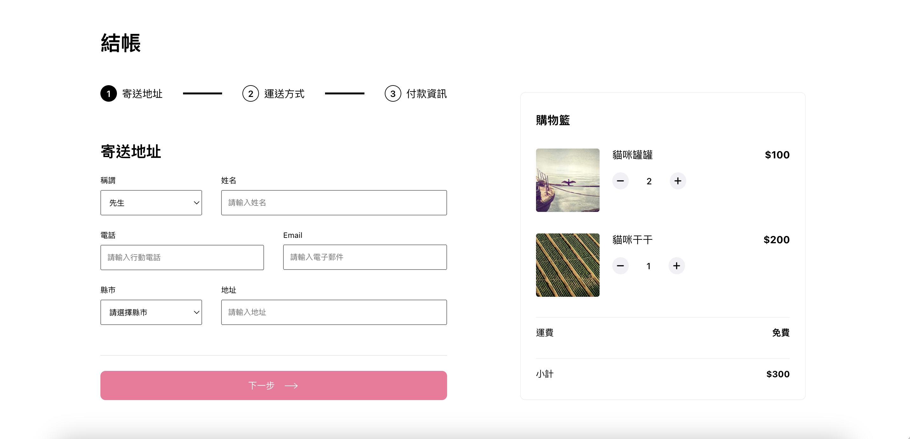

# Alpha Shop



# Intro

Alpha Shop is a project for online clothing shpping built with React.js. It's still a static website only demonstrating the payment page at the moment.

## Getting Start

1. Install Node.js and NPM on your local machine
2. Clone the project from GitHub repository

```
$ git clone https://github.com/kaihsu12/react-shop-site-02.git
```

3. Install the package needed to run the project

```
$ npm install
```

4. Start the React project

```
$ npm start
```

4. Terminate the React project

```
Ctrl + C
```
